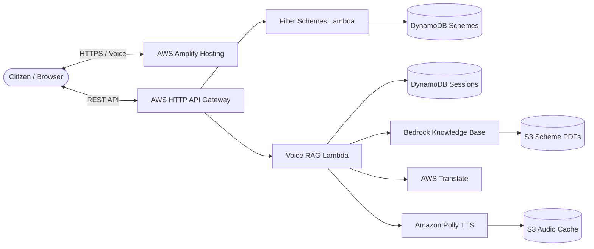

# JanKalyan (जनकल्याण) — Voice-First Government Scheme Navigator

[](https://main.d2l2gs67zimgc.amplifyapp.com)
[](https://aws.amazon.com/serverless/)
[](https://aws.amazon.com/bedrock/)
[](https://react.dev)

> **JanKalyan** is a voice-first, AI-powered multilingual government scheme discovery and eligibility platform engineered for Indian citizens. It allows farmers, women entrepreneurs, artisans, and students to discover, check eligibility, and understand government schemes in their mother tongue with verified citations from official government guidelines.

---

## 🌟 Key Features

- **🎙️ Voice-First Conversational Interface**: Citizens can speak via their microphone in natural Hinglish, Hindi, or any regional language to query schemes and verify eligibility.
- **🇮🇳 9 Indian Regional Languages**: Comprehensive native language localization for **English, Hindi (हिन्दी), Bengali (বাংলা), Marathi (मराठी), Telugu (తెలుగు), Tamil (தமிழ்), Gujarati (ગુજરાતી), Urdu (اردو), and Kannada (ಕನ್ನಡ)**.
- **🧠 Zero-Hallucination Retrieval Augmented Generation (RAG)**: Answers are strictly grounded in official gazette guidelines and ministry operational PDFs indexed in **AWS Bedrock Knowledge Bases**.
- **📄 Instant PDF Citations with Inline Previews**: Citations provide direct links to the official PDF page, utilizing secure **pre-signed S3 URLs** so documents open inline without authentication errors.
- **🔊 Neural Indian Speech Synthesis**: Answers are spoken aloud using **Amazon Polly** (`Kajal` neural voice) with client-side Web Speech Synthesis fallback.
- **🎯 Dynamic Scheme Matching**: Filter by Landholding Size, Category, Income, Age, and State with automated eligibility match percentages (0–100%).
- **⚖️ Comparison Matrix**: Side-by-side comparison of benefits, application steps, and required documents.

---

## 🚀 Live Demo & Endpoints

- **Live Web Application**: [https://main.d2l2gs67zimgc.amplifyapp.com](https://main.d2l2gs67zimgc.amplifyapp.com)
- **Backend API Gateway**: `https://qo950rv93f.execute-api.us-east-1.amazonaws.com/prod`
  - `GET /schemes` — List all schemes or filter by criteria
  - `GET /schemes/{id}` — Get single scheme details
  - `POST /chat` — Conversational Voice RAG with Polly speech synthesis
  - `POST /eligibility` — Scheme-specific eligibility assessment

---

## 🏗️ System Architecture



For the comprehensive architectural breakdown, see **[Detailed Project Documentation](docs/PROJECT_DOCUMENTATION.md)**.

---

## 💻 Local Development Setup

### 1. Prerequisites
- Node.js 20+
- Python 3.11+
- AWS CLI configured with credentials

### 2. Frontend Setup
```bash
cd frontend
npm install
npm run dev
```
The frontend will start at `http://localhost:5173/` with an automatic proxy forwarding `/api` calls to the live AWS backend.

### 3. Backend Setup (AWS SAM)
```bash
cd backend
# Build the serverless application
sam build

# Deploy to AWS
sam deploy --parameter-overrides KnowledgeBaseId="HDGCKVKYEE" AllowedOrigin="*"
```

### 4. Seed DynamoDB Schemes
```bash
python backend/scripts/seed_dynamodb.py
```

---

## 📚 Documentation
- **[Full Project Documentation](docs/PROJECT_DOCUMENTATION.md)**: Detailed architecture, RAG design, translation system, and security model.
- **[Deployment Outputs](docs/deployment-outputs.md)**: Cloud resource identifiers and bucket names.

---

## 📄 License
This project is open-source under the MIT License.
