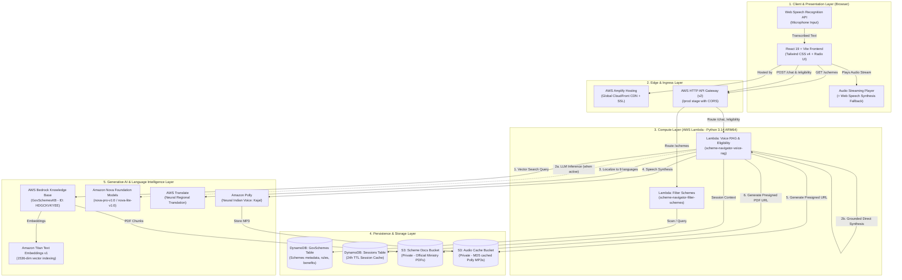
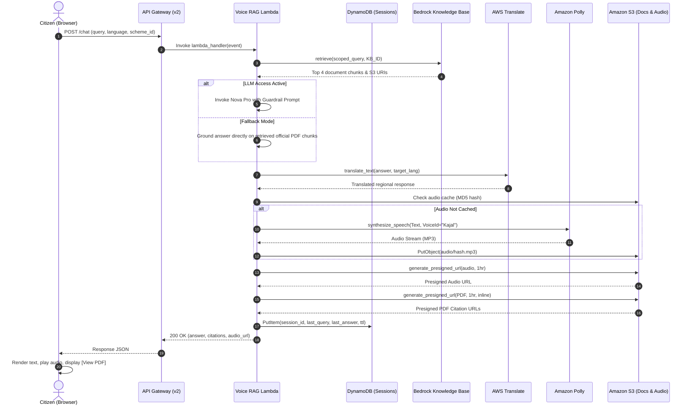

# JanKalyan (जनकल्याण) — System Architecture Document
### In-Depth Architectural Specification and Component Design

---

## 1. Architectural Principles & Paradigm

**JanKalyan** is architected on four core design tenets:
1. **100% Serverless & Event-Driven**: There are zero persistent EC2 virtual machines or provisioned container clusters. All resources execute ephemerally on demand, autoscaling from zero to thousands of concurrent requests while remaining virtually cost-free when idle.
2. **Zero-Hallucination Grounded AI (RAG)**: Conversational responses are not left to unconstrained model imagination. Answers are strictly bounded by official government operational guidelines stored in a vector knowledge base.
3. **Resilient Dual-Tier Fallback**: The architecture operates independently of third-party model availability or AWS account-level foundation model activation holds.
4. **Private-by-Default Security**: All cloud storage buckets strictly enforce `BlockPublicAcls` and `BlockPublicPolicy`. All document access uses temporary, cryptographically signed pre-signed URLs.

---

## 2. End-to-End System Architecture Diagram

<b>Mermaid Diagram Definition</b>

---

## 3. The Five Structural Layers

### 3.1. Client & Presentation Layer (Frontend)
- **Framework**: React 19, Vite 6, TypeScript.
- **Styling**: Tailwind CSS v4 using semantic design tokens tailored for rural and urban Indian citizens.
- **Speech-to-Text (STT)**: Integrated with the Web Speech API (`webkitSpeechRecognition`). Automatically configures language BCP-47 codes (e.g., `hi-IN` for Hindi, `mr-IN` for Marathi, `ta-IN` for Tamil).
- **Text-to-Speech (TTS)**: Plays cached Amazon Polly audio via HTML5 `<audio>` streaming, with a client-side `window.speechSynthesis` fallback for offline or low-connectivity environments.
- **State & Caching**: TanStack Query (`@tanstack/react-query`) handles query deduplication, background caching, and automatic refetching.

### 3.2. Edge & Ingress Layer
- **AWS Amplify Hosting**: Hosts the single-page application and distributes static assets globally across Amazon CloudFront edge nodes with HTTP/2 and TLS 1.3 encryption.
- **AWS HTTP API Gateway (v2)**: Serves as the central API gateway at `https://qo950rv93f.execute-api.us-east-1.amazonaws.com/prod`:
  - Auto-manages CORS (`Access-Control-Allow-Origin: *`, `AllowHeaders: [content-type, x-session-id]`).
  - Low latency proxy routing directly to AWS Lambda functions without intermediate proxies.

### 3.3. Compute Layer (AWS Lambda)
Serverless execution runs on AWS Graviton (ARM64) processors running Python 3.14:
- **`scheme-navigator-filter-schemes`**:
  - Memory: 512 MB, Timeout: 10s.
  - Queries DynamoDB and computes matching scores against farmer landholdings, annual income, age, and state categories.
- **`scheme-navigator-voice-rag`**:
  - Memory: 1024 MB, Timeout: 60s.
  - Coordinates vector retrieval from Bedrock Knowledge Bases, translation via AWS Translate, voice synthesis via Amazon Polly, and pre-signed S3 URL generation.

### 3.4. Generative AI & Language Intelligence Layer
- **Amazon Bedrock Knowledge Base (`HDGCKVKYEE` — `GovSchemesKB`)**: Indexes official government gazettes using **Amazon Titan Text Embeddings v1** (1536 dimensions).
- **Dual-Tier Resilient Answering**:
  - *Tier 1*: High-capacity foundation model generation via Amazon Nova (`amazon.nova-pro-v1:0` / `amazon.nova-lite-v1:0`).
  - *Tier 2 (Fallback)*: Grounded direct extraction from retrieved Knowledge Base vectors, dynamically translating via AWS Translate when account-level model access holds are in place.
- **AWS Translate**: Translates scheme rules and answers into 9 Indian regional languages with grammar tailored for spoken clarity.
- **Amazon Polly**: Synthesizes Hindi and Indian English audio streams using the neural `Kajal` voice.

### 3.5. Persistence & Storage Layer
- **`scheme-navigator-GovSchemes` (DynamoDB)**: Pay-per-request table containing normalized scheme metadata, criteria, benefits, and application URLs.
- **`scheme-navigator-Sessions` (DynamoDB)**: Manages anonymous user conversation state with a 24-hour Time-to-Live (`ttl`) expiration for privacy.
- **`gov-schemes-docs-...` (Amazon S3)**: Private document store holding the original official ministry PDFs with server-side AES-256 encryption.
- **`gov-schemes-audio-...` (Amazon S3)**: Private audio cache storing generated Polly MP3s with a 7-day automated lifecycle expiry.

---

## 4. End-to-End Request Lifecycles

### 4.1. Voice RAG & Eligibility Assessment Flow

---

## 5. Security & Isolation Architecture

1. **Zero Public S3 Buckets**: Both the PDF storage bucket and Polly audio cache bucket enforce `BlockPublicAcls: true` and `BlockPublicPolicy: true`. All external access requires short-lived AWS Signature Version 4 URLs.
2. **Inline PDF Streaming**: Citation URLs are signed with:
   - `ResponseContentType: application/pdf`
   - `ResponseContentDisposition: inline`
   This allows mobile devices and desktop browsers to open the official government guidelines directly inside a tab without downloading unverified files.
3. **Session Privacy**: Conversation sessions in DynamoDB are decoupled from citizen identity and automatically expire after 24 hours via DynamoDB TTL.
4. **IAM Least Privilege**: Each Lambda function is assigned a dedicated execution role with fine-grained Resource ARNs.

---

## 6. Active Infrastructure Reference

| Resource Component | AWS Resource Name / Identifier | Region |
| :--- | :--- | :--- |
| **API Gateway Endpoint** | `https://qo950rv93f.execute-api.us-east-1.amazonaws.com/prod` | `us-east-1` |
| **Amplify Web URL** | `https://main.d2l2gs67zimgc.amplifyapp.com` | Global CDN |
| **Bedrock Knowledge Base** | `HDGCKVKYEE` (`GovSchemesKB`) | `us-east-1` |
| **Embedding Model** | `amazon.titan-embed-text-v1` | `us-east-1` |
| **Schemes Database** | `scheme-navigator-GovSchemes` | `us-east-1` |
| **Sessions Database** | `scheme-navigator-Sessions` | `us-east-1` |
| **Document Storage Bucket** | `gov-schemes-docs-892667863574-us-east-1` | `us-east-1` |
| **Audio Cache Bucket** | `gov-schemes-audio-892667863574-us-east-1` | `us-east-1` |
| **Filter Schemes Function** | `scheme-navigator-filter-schemes` | `us-east-1` |
| **Voice RAG Function** | `scheme-navigator-voice-rag` | `us-east-1` |

---
*JanKalyan Scheme Navigator Architecture Specification.*
