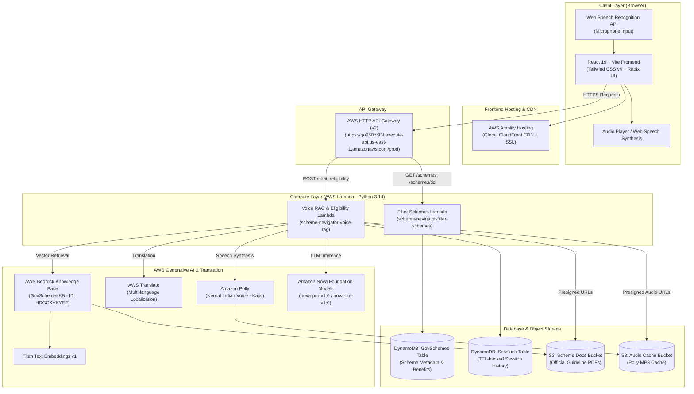

# JanKalyan (जनकल्याण) — Voice-First Government Scheme Navigator
### Comprehensive Architecture, Implementation, and Operations Guide

---

## 1. Executive Summary & Vision

**JanKalyan** is a voice-first, multilingual, AI-powered government scheme discovery and eligibility platform engineered for Indian citizens. 

### The Problem
India has hundreds of transformative central and state welfare initiatives (e.g., PM-KISAN, PM-KUSUM, Ayushman Bharat PM-JAY, Pradhan Mantri MUDRA Yojana, and National Scholarship Schemes). However:
- **Literacy & Language Barriers**: Most government portals are text-heavy and predominantly in formal English or official Hindi. Rural farmers, daily-wage workers, and small business owners often cannot navigate them.
- **Complex Eligibility Rules**: Scheme guidelines are 50–100 page legal PDFs. Citizens struggle to know if their land size (acres vs. hectares), income, or state makes them eligible.
- **Hallucination Risk**: Traditional chatbots often invent benefits, subsidy percentages, or application deadlines.

### The Solution
JanKalyan bridges this gap through:
1. **Voice-First Conversational Interface**: Citizens can speak naturally into their phone or computer in their native language or Hinglish (e.g., *"mai ek maharashtra ka kisan hu kya mai ye scheme ke tehet maanya hu?"*).
2. **Multilingual Reach (9 Languages)**: Complete support for **Hindi, Bengali, Marathi, Telugu, Tamil, Gujarati, Urdu, Kannada, and English**.
3. **Zero-Hallucination Retrieval Augmented Generation (RAG)**: Answers are strictly grounded in official gazette guidelines and ministry operational PDFs stored in AWS Bedrock Knowledge Bases.
4. **Instant Official PDF Citations**: Every answer provides direct references to the exact PDF page, complete with secure inline document preview links.
5. **Neural Speech Playback**: High-quality Indian voice synthesis via Amazon Polly (`Kajal` neural voice) with client-side speech synthesis fallback.

---

## 2. System Architecture

The project is built on a 100% serverless, decoupled cloud architecture hosted on Amazon Web Services (AWS) in the `us-east-1` region.



---

## 3. Core Capabilities & Workflows

### 3.1. The Voice RAG Pipeline (Query to Speech)
When a citizen taps the microphone and asks a question:
1. **Audio to Text (STT)**: The browser's native `webkitSpeechRecognition` captures spoken words in the selected regional language.
2. **API Dispatch**: `POST /api/chat` sends the query, target language (`hi`, `mr`, `ta`, etc.), and active scheme ID to API Gateway.
3. **Vector Semantic Search**: Lambda queries **AWS Bedrock Knowledge Base** (`HDGCKVKYEE`). The Knowledge Base uses Amazon Titan Embeddings to retrieve the top 4 most relevant text passages from official scheme PDFs.
4. **Resilient Answering Engine**:
   - **Tier 1 (Amazon Nova)**: If Nova model access is active, it prompts Nova with a strict system guardrail preventing hallucination and unit errors (e.g. converting acres to hectares).
   - **Tier 2 (Direct KB Retrieval Fallback)**: If model access is on hold, the Lambda directly extracts the verified scheme guidelines and constructs an eligibility assessment from the retrieved gazette documents.
5. **Language Translation**: The answer is processed via **AWS Translate** to render natural, idiomatic text in the user's selected regional language.
6. **Official PDF Presigning**: The Lambda locates the original S3 PDF key and issues a secure **pre-signed S3 URL** with `response-content-disposition=inline` and `response-content-type=application/pdf` so the citizen can click `[View PDF]` and inspect the government gazette on their phone.
7. **Neural Speech Synthesis (TTS)**: The translated response is synthesized using **Amazon Polly** (`Kajal` neural voice). The resulting audio stream is cached in an S3 bucket keyed by the MD5 hash of the text, returning a streaming URL to the client.

### 3.2. Scheme Filtering & Match Scoring
- The `scheme-navigator-filter-schemes` Lambda executes against DynamoDB.
- When citizens apply filters (e.g., State: *Maharashtra*, Land Size: *Small / Marginal (< 2 Ha)*, Category: *Agriculture*, Income: *< ₹2.5 Lakh*), the Lambda evaluates eligibility rules and assigns a **Match Score (0–100%)** with specific matched reasons displayed on cards.

---

## 4. Repository & Directory Structure

```text
scheme-navigator/
├── .gitignore                   # Comprehensive ignore rules (excluding credentials & build artifacts)
├── README.md                    # Repository introduction & quickstart
├── backend/                     # Serverless backend (AWS SAM)
│   ├── data/                    # Seed metadata and official PDF files
│   │   ├── pdfs/                # 5 Official Gazette PDFs (PM-KISAN, PM-KUSUM, Ayushman, Mudra, UGC)
│   │   └── schemes.json         # Normalized DynamoDB seed data
│   ├── samconfig.toml           # SAM deployment configuration
│   ├── template.yaml            # AWS CloudFormation / SAM Infrastructure as Code template
│   ├── scripts/
│   │   └── seed_dynamodb.py     # Python script to populate DynamoDB with initial schemes
│   └── src/
│       ├── filter_schemes/      # Lambda: Scheme discovery & filtering
│       │   ├── app.py           # Filtering logic & scoring algorithm
│       │   └── requirements.txt
│       └── voice_rag/           # Lambda: Voice RAG conversational assistant
│           ├── app.py           # Bedrock KB retrieval, Translate, Polly & S3 presigning
│           └── requirements.txt
├── docs/                        # Architecture diagrams and configuration outputs
│   ├── deployment-outputs.md    # Active AWS resource ARNs and endpoints
│   └── PROJECT_DOCUMENTATION.md # (This document)
└── frontend/                    # Web Application (React 19 + Vite 6 + Tailwind CSS v4)
    ├── package.json             # NPM dependencies (React 19, Radix UI, TanStack Query)
    ├── tsconfig.json            # TypeScript configuration with @/ alias
    ├── vite.config.ts           # Vite bundler configuration (outputs to dist/)
    ├── public/                  # Favicons, manifests, and static assets
    └── src/
        ├── App.tsx              # Main dashboard (Hero, Filters, Scheme Cards, Comparison)
        ├── main.tsx             # Application entrypoint
        ├── index.css            # Custom design tokens & modern CSS styling
        ├── components/
        │   ├── error-boundary.tsx # React error boundary
        │   ├── voice-drawer.tsx   # Voice RAG assistant sliding drawer & audio player
        │   └── ui/                # 40+ Accessible UI components (Radix primitives)
        ├── data/
        │   ├── jankalyan.ts      # Supported regional languages & mock schemes
        │   └── translations.ts    # Comprehensive 9-language native dictionary
        ├── hooks/
        │   ├── useChat.ts         # Hook managing voice RAG queries and audio playback
        │   ├── useSchemes.ts      # TanStack Query hook for fetching schemes from DynamoDB
        │   └── use-toast.ts       # Toast notifications
        └── lib/
            ├── api.ts             # Centralized HTTP client for AWS endpoints
            └── utils.ts           # ClassName merge utilities (clsx + tailwind-merge)
```

---

## 5. Backend Deep Dive

### 5.1. AWS SAM Template (`backend/template.yaml`)
Declaratively provisions all cloud infrastructure:
- **`SchemeDocsBucket`**: Private S3 bucket with AES-256 server-side encryption and 365-day lifecycle retention.
- **`AudioCacheBucket`**: Private S3 bucket caching generated Polly MP3s with a 7-day auto-expiry lifecycle rule.
- **`SchemesTable`**: DynamoDB table with `scheme_id` partition key and a Global Secondary Index on `primary_category`.
- **`SessionsTable`**: DynamoDB table with `session_id` partition key and native DynamoDB Time-To-Live (`ttl`) expiration (24 hours).
- **`SchemeApi`**: AWS HTTP API Gateway (v2) with CORS configured for all origins (`*`) and headers (`content-type`, `x-session-id`).
- **`FilterSchemesFunction`**: ARM64 Lambda function running Python 3.14 with DynamoDB read policies.
- **`VoiceRagFunction`**: ARM64 Lambda (1024 MB RAM, 60s timeout) with IAM permissions for Bedrock, Polly, AWS Translate, S3, and DynamoDB.

### 5.2. Voice RAG Implementation (`backend/src/voice_rag/app.py`)
Key modules and algorithmic decisions:
- **Bedrock Retrieval**: Calls `bedrock_agent.retrieve(knowledgeBaseId=KB_ID, retrievalQuery={'text': scoped_query})` to isolate context chunks without executing unconstrained queries.
- **Dynamic Translation**:
  ```python
  def _translate_to_target_lang(text: str, lang_code: str) -> str:
      target = (lang_code or "").split("-")[0].lower()
      if not target or target in ("en",):
          return text
      res = translate_client.translate_text(
          Text=text,
          SourceLanguageCode="en",
          TargetLanguageCode=target
      )
      return res.get("TranslatedText", text)
  ```
- **Pre-signed S3 PDF Viewer**:
  ```python
  s3.generate_presigned_url(
      "get_object",
      Params={
          "Bucket": bucket,
          "Key": key,
          "ResponseContentType": "application/pdf",
          "ResponseContentDisposition": "inline"
      },
      ExpiresIn=3600
  )
  ```
  This allows citizens on mobile or desktop to inspect the official PDF inline inside their browser tab without opening the bucket to the public internet.

---

## 6. Frontend Deep Dive

### 6.1. Multilingual Localization System (`frontend/src/data/translations.ts`)
Rather than relying solely on client-side Google Translate widgets (which often corrupt layout and fail on dynamic components), JanKalyan implements a **native static dictionary** covering 9 Indian languages:
1. English (`en`)
2. Hindi (`hi` - हिन्दी)
3. Bengali (`bn` - বাংলা)
4. Marathi (`mr` - मराठी)
5. Telugu (`te` - తెలుగు)
6. Tamil (`ta` - தமிழ்)
7. Gujarati (`gu` - ગુજરાતી)
8. Urdu (`ur` - اردو)
9. Kannada (`kn` - ಕನ್ನಡ)

Every headline, badge, filter dropdown, and scheme summary reactively changes instantly when the citizen taps a language card in the top bar.

### 6.2. Interactive Voice Assistant Drawer (`frontend/src/components/voice-drawer.tsx`)
- **Speech Recognition**: Integrated with browser `webkitSpeechRecognition` / `SpeechRecognition` configured for the active regional language code (e.g. `hi-IN`, `mr-IN`, `ta-IN`).
- **Responsive Viewport Containment**: Configured with `h-[88vh] max-h-[88dvh]` and `flex-1 overflow-y-auto` so the scrollable conversation feed never overlaps or pushes the audio player or input box off-screen.
- **Audio Playback**: Uses an HTML5 `<audio>` element to stream cached Polly MP3s with a fallback to `window.speechSynthesis` if network audio playback is restricted.

---

## 7. Cloud Deployment & CI/CD Guide

### 7.1. Backend Deployment (AWS SAM)
The backend is deployed using the AWS Serverless Application Model (SAM):
```bash
cd backend
sam build
sam deploy --parameter-overrides KnowledgeBaseId="HDGCKVKYEE" AllowedOrigin="*"
```

To seed initial scheme data into DynamoDB:
```bash
python backend/scripts/seed_dynamodb.py
```

### 7.2. Frontend Deployment (AWS Amplify Hosting)
The frontend is hosted on **AWS Amplify Hosting** with automatic continuous deployment connected to the GitHub repository:
- **Repository**: `https://github.com/mannank77/scheme-navigator`
- **Branch**: `main`
- **App Root / Monorepo Directory**: `frontend`
- **Build Specification** (`amplify.yml`):
  ```yaml
  version: 1
  applications:
    - frontend:
        phases:
          preBuild:
            commands:
              - npm ci --cache .npm --prefer-offline
          build:
            commands:
              - npm run build
        artifacts:
          baseDirectory: dist
          files:
            - '**/*'
        cache:
          paths:
            - .npm/**/*
      appRoot: frontend
  ```
- **Live Production URL**: `https://main.d2l2gs67zimgc.amplifyapp.com`

---

## 8. Security & Best Practices

1. **Zero Public S3 Buckets**: All document and audio S3 buckets enforce `BlockPublicAcls: true` and `BlockPublicPolicy: true`. Data access is strictly controlled via temporary pre-signed URLs expiring in 1 hour.
2. **Least-Privilege IAM**: Lambdas only possess explicit read/write permissions to their designated S3 prefixes and DynamoDB tables.
3. **Session Privacy**: Chat histories stored in DynamoDB have automated 24-hour TTL expiration and never record Aadhaar numbers, bank accounts, or personal citizen identifiers.
4. **No Hardcoded Secrets**: Zero AWS access keys, secret keys, or bearer tokens exist in the codebase. All authentication relies on AWS IAM execution roles and temporary session credentials.

---

## 9. Active AWS Infrastructure Reference

| Resource | ID / Identifier | Description |
| :--- | :--- | :--- |
| **AWS Region** | `us-east-1` | US East (N. Virginia) |
| **AWS Account** | `892667863574` | Active deployment account |
| **API Base URL** | `https://qo950rv93f.execute-api.us-east-1.amazonaws.com/prod` | HTTP API Gateway v2 |
| **Amplify Web App** | `https://main.d2l2gs67zimgc.amplifyapp.com` | Production Web URL |
| **Bedrock KB** | `HDGCKVKYEE` (`GovSchemesKB`) | Vector knowledge base over official scheme PDFs |
| **Embedding Model** | `amazon.titan-embed-text-v1` | 1536-dimensional vector embedding model |
| **Document Bucket** | `gov-schemes-docs-892667863574-us-east-1` | S3 bucket containing official government PDFs |
| **Audio Bucket** | `gov-schemes-audio-892667863574-us-east-1` | S3 cache for Polly speech MP3s |
| **Schemes DB** | `scheme-navigator-GovSchemes` | DynamoDB scheme definitions & rules |
| **Sessions DB** | `scheme-navigator-Sessions` | DynamoDB conversation session cache (TTL-enabled) |

---
*Created for the JanKalyan Scheme Navigator Project.*
